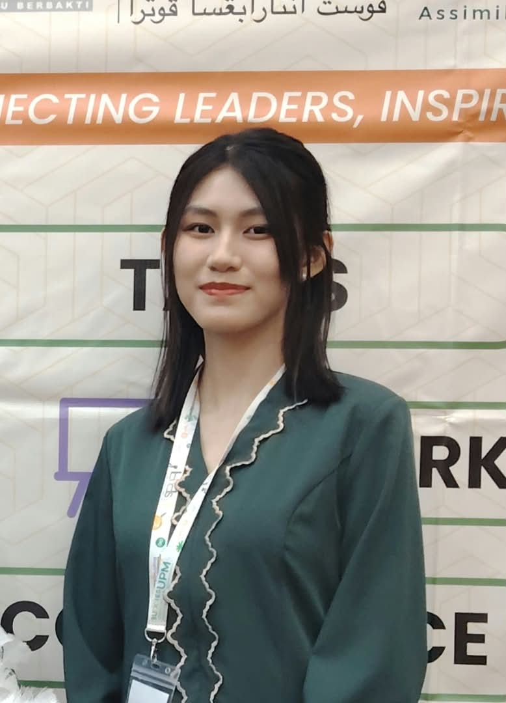

## Hi there 👋

Hi! I'm Kristern Lim Yu Xi, a Software Engineering student at Universiti Malaya.

I'm interested in software development and building practical applications. Through the Software Maintenance and Evolution course, I hope to improve my understanding of maintaining existing software, identifying and fixing bugs, and mastering using tools like Git and GitHub.

* **Fun fact:** I enjoy learning Japanese and exploring new cultures from different countries.
* **Course expectations:** I hope to gain hands-on experience in software maintenance, version control, code reviews, and collaborative software development.

<!--
**kristern1257/kristern1257** is a ✨ _special_ ✨ repository because its `README.md` (this file) appears on your GitHub profile.

Here are some ideas to get you started:

- 🔭 I’m currently working on ...
- 🌱 I’m currently learning ...
- 👯 I’m looking to collaborate on ...
- 🤔 I’m looking for help with ...
- 💬 Ask me about ...
- 📫 How to reach me: ...
- 😄 Pronouns: ...
- ⚡ Fun fact: ...
-->
